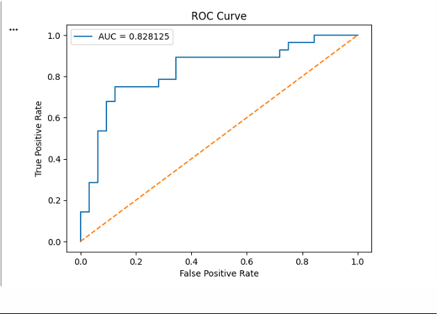
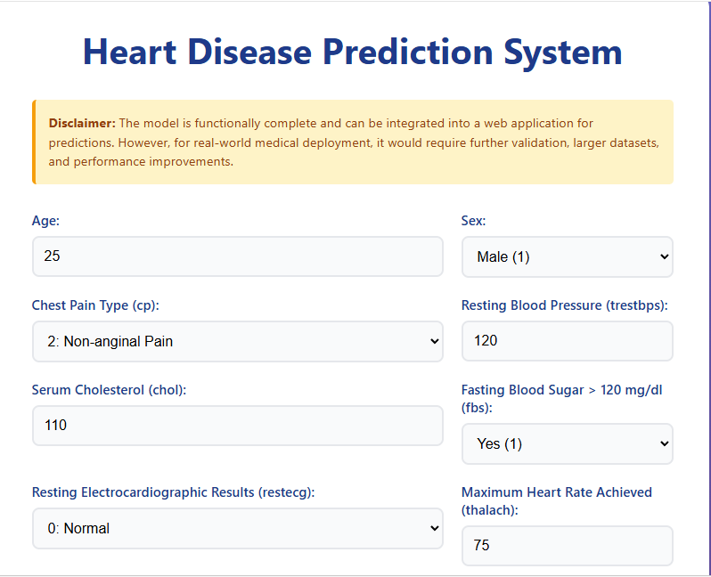
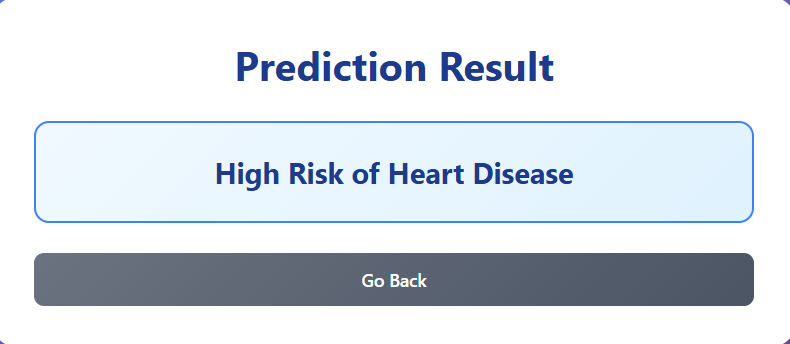

# Heart Disease Prediction System (ML + Web App)

## 1. Project Overview

This project predicts heart disease risk using machine learning. It uses medical attributes such as age, cholesterol, chest pain type, and other clinical parameters to classify patients into risk categories. The system is built as a binary classification model designed to assist in early detection of cardiovascular disease.

## 2. Objective

The primary objectives of this project are:

- Build a binary classification model to predict heart disease presence
- Analyze important medical features that contribute to cardiovascular risk
- Evaluate model performance using standard machine learning metrics (accuracy, ROC-AUC, confusion matrix)
- Deploy the trained model via a user-friendly web application for demonstration purposes

## 3. Dataset

The project uses the **Heart Disease UCI Dataset**, a structured medical dataset containing patient records with clinical attributes.

**Features:**
- `age` - Age of the patient
- `sex` - Gender (0 = Female, 1 = Male)
- `cp` - Chest pain type (0-3)
- `trestbps` - Resting blood pressure (mm Hg)
- `chol` - Serum cholesterol (mg/dl)
- `fbs` - Fasting blood sugar > 120 mg/dl (0 = No, 1 = Yes)
- `restecg` - Resting electrocardiographic results (0-2)
- `thalach` - Maximum heart rate achieved
- `exang` - Exercise induced angina (0 = No, 1 = Yes)
- `oldpeak` - ST depression induced by exercise
- `slope` - Slope of the peak exercise ST segment (0-2)
- `ca` - Number of major vessels (0-4)
- `thal` - Thalassemia (1-3)

**Target Variable:**
- `condition` - Heart disease presence (0 = No Disease, 1 = Disease)

## 4. Machine Learning Pipeline (Main Focus)

### 4.1 Data Cleaning

- Checked for missing values across all features
- Handled null values using mean imputation where applicable
- Verified data types and converted to appropriate formats
- Ensured no duplicate records in the dataset

### 4.2 Exploratory Data Analysis (EDA)

- **Target Distribution Analysis**: Examined the balance between positive and negative cases
- **Correlation Heatmap**: Visualized relationships between features to identify multicollinearity
- **Feature Relationships**: Analyzed how individual features correlate with the target variable
- **Statistical Summary**: Generated descriptive statistics for all numerical features

### 4.3 Model Selection

**Logistic Regression** was selected for binary classification due to:

- Simplicity and interpretability of results
- Effective performance on structured medical data
- Provides probability outputs for risk assessment
- Computationally efficient for real-time predictions
- Well-suited for binary classification tasks

### 4.4 Model Training

- **Train-Test Split**: 80% training data, 20% testing data
- **Feature Scaling**: Applied standardization to numerical features
- **Model Training**: Trained Logistic Regression on the training set using all 13 medical features
- **Cross-Validation**: Performed k-fold cross-validation to ensure model stability

### 4.5 Model Evaluation

The model was evaluated using the following metrics:

- **Accuracy (~73%)**: The proportion of correct predictions out of all predictions made. This indicates the model correctly classifies approximately 73% of cases.

- **Confusion Matrix**: A table showing true positives, true negatives, false positives, and false negatives. This helps understand the types of errors the model makes.

- **ROC Curve**: Receiver Operating Characteristic curve plotting the true positive rate against the false positive rate at various threshold settings.

- **AUC Score (~0.82)**: Area Under the ROC Curve. A score of 0.82 indicates good discriminatory power, suggesting the model effectively distinguishes between patients with and without heart disease.

#### ROC Curve Visualization



### 4.6 Feature Importance

Analysis identified the most influential features for prediction:

- **ca** (Number of major vessels) - Strong predictor of cardiovascular blockage
- **sex** - Gender-based risk differences
- **thal** (Thalassemia) - Blood disorder indicator
- **exang** (Exercise induced angina) - Critical symptom indicator

These features contribute significantly to the model's decision-making process.

## 5. Model Performance Summary

| Metric | Value |
|--------|-------|
| Accuracy | ~73% |
| ROC-AUC | ~0.82 |
| Dataset Balance | Balanced |
| Classification Performance | Good |

The model demonstrates solid classification performance with an AUC score of 0.82, indicating good ability to distinguish between classes. The accuracy of 73% is reasonable for medical prediction tasks given the complexity of cardiovascular disease.

## 6. Model Limitations

**Important Considerations:**

- The dataset is relatively small, which may limit the model's generalizability
- The model is not validated for clinical use and should not replace professional medical diagnosis
- Requires more diverse data and hyperparameter tuning for real world deployment
- May not capture all risk factors present in real patient populations
- External validation on larger, more diverse datasets is needed

**Disclaimer:**

> The model is functionally complete and can be integrated into a web application for predictions. However, for real world medical deployment, it would require further validation, larger datasets, and performance improvements.

## 7. Model Saving

The trained model was serialized using the `joblib` library for efficient loading and deployment.

- **File Name**: `DHC-1898 task 3 model.pkl`
- **Format**: Pickle file containing the trained Logistic Regression model
- **Location**: `model/` directory

## 8. Web Application (Deployment Layer)

As a demonstration of the model's capabilities, a web application was built to allow users to interact with the trained model.

### Features

- User friendly input form with all 13 medical parameters
- Dropdown menus for categorical attributes (sex, chest pain type, etc.)
- Real-time prediction using the loaded model
- Clear display of risk assessment results
- Responsive design for desktop and mobile devices

#### Web Application Interface



#### Prediction Result



### Tech Stack

- **Backend**: Flask (Python web framework)
- **Frontend**: HTML5, CSS3
- **ML Integration**: joblib for model loading and prediction
- **Styling**: Custom CSS with medical-themed design

### Workflow

```
User Input → Backend Processing → Model Prediction → Result Display
```

The web application serves as an interface layer, collecting user inputs and passing them to the trained model for prediction.

## 9. Project Structure

```
heart-disease-app/
│
├── app.py                          # Flask backend application
├── requirements.txt                # Python dependencies
├── model/
│   └── DHC-1898 task 3 model.pkl   # Trained ML model
├── templates/
│   ├── index.html                  # Input form page
│   └── result.html                 # Prediction result page
├── static/
│   └── style.css                   # Styling for the application
└── README.md                       # This file
```

## 10. How to Run the Project

### Prerequisites

- Python 3.7 or higher
- pip package manager

### Installation Steps

1. **Install dependencies:**
   ```bash
   pip install -r requirements.txt
   ```

   This will install:
   - Flask (web framework)
   - NumPy (numerical computing)
   - joblib (model loading)

2. **Run the application:**
   ```bash
   python app.py
   ```

3. **Open browser:**
   Navigate to `http://127.0.0.1:5000/`

4. **Use the application:**
   - Fill in the medical parameters in the form
   - Click "Predict" to get the risk assessment
   - View the result on the results page

## 11. Future Improvements

Potential enhancements for the project:

- **Advanced Models**: Implement ensemble methods like Random Forest, XGBoost, or Neural Networks for potentially better accuracy
- **Performance Tuning**: Hyperparameter optimization using grid search or Bayesian optimization
- **Probability Output**: Display probability scores alongside binary predictions for more nuanced risk assessment
- **Feature Engineering**: Create additional derived features from existing medical parameters
- **Cross Validation**: Implement more robust cross validation strategies
- **Cloud Deployment**: Deploy the application on cloud platforms (AWS, Heroku, etc.) for wider accessibility
- **API Development**: Create a REST API for integration with other systems
- **Dataset Expansion**: Incorporate larger, more diverse datasets for improved generalizability

## 12. Conclusion

This project demonstrates a complete machine learning pipeline for heart disease prediction, from data analysis and model training to web application deployment. While the current model shows promising results, further development and validation would be necessary for clinical application. The web application serves as a practical demonstration of how machine learning models can be integrated into user-facing systems.

## 13. Developer/Author

Haris Hussain